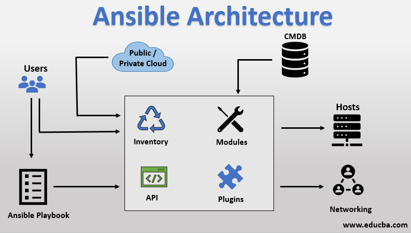

# Ansible-tutorial

 

**This Repo contains many sample codes with explainations (Linux Configuration Managemnet)to help you find your need of ansible very easily and in a structured manner.**

## Published articles:

 - [Ansible Tutorial - Part 0 - Getting Ready to Ansible](./part00-getting-ready/)

 - [Ansible Tutorial - Part 1 - User Management](./part01-create-user/)

 - [Ansible Tutorial - Part 2 - Upgrade OS](./part02-update-linux/)
 
 - [Ansible Tutorial - Part 3 - Basic configration] (In Progress)

 - [Ansible Tutorial - Part 4 - Install Docker](./part04-docker-install/)
 
 - [Ansible Tutorial - Part 5 - Install LAMP Stack](./part05-lamp-stack-install/)

 - [Ansible Tutorial - Part 6 - Install LEMP Stack](./part06-lemp-stack-install)

 - [Ansible Tutorial - Part 7 - Install Elasticsearch](./part07-elasticsearch-install/)
 
 - [Ansible Tutorial - Part 8 - Cron Jobs ](./part08-create-cronjob/)
 
 - [Ansible Tutorial - Part 9 - Install Grafana](./part09-grafana-install)

 - [Ansible Tutorial - Part 10 - Install Zabbix](./part10-zabbix-install)
 
 - [Ansible Tutorial - Part 11 - Install Redis](./part11-redis-install)

 - [Ansible Tutorial - Part 12 - Install RabbitMQ](./part12-rabbitmq-install) 
 
 - [Ansible Tutorial - Part 13 - Install Zabbix-Agent](./part13-zabbix-agent-install) 
 
 - [Ansible Tutorial - Part 14 - Install Tomcat](./part14-tomcat-install) 

 - [Ansible Tutorial - Part 15 - Install Docker Swarm](./part15-docker-swarm-install) 

 - [Ansible Tutorial - Part 16 - Install Nginx](./part16-nginx-install) 

 - [Ansible Tutorial - Part 17 - Install Mattermost](./part17-mattermost-install)

 - [Ansible Tutorial - Part 18 - Install & Update Packages (APT)](./part18-package-manager/)

 - [Ansible Tutorial - Part 19 - Config Sysctl](./part19-config-sysctl/)

 - [Ansible Tutorial - Part 20 - Configure PostgreSQL HBA](./part20-config-pg-hba/)

 - [Ansible Tutorial - Part 21 - Install zabbix-agent2](./part21-zabbix-agent2-deb/)

 - [Ansible Tutorial - Part 22 - Setup K8S Worker Nodes](./part22-k8s-worker-init/)

 - [Ansible Tutorial - Part 23 - Initial Ubuntu Configuration](./part23-config-os_ubuntu-init/) 

 - [Ansible Tutorial - Part 24 - Install Jenkins](./part24-jenkins-jcasc/)
 
 - [Ansible Tutorial - Part 25 - setup nfs server](./part25-setup-nfs-server/)
 - [Ansible Tutorial - Part 25 - Install apache](./part26-apache-install/)

## Contributions:

All contributions are welcomed. Help me to enrich this repository.

If you find any **bugs** in the examples, please file an issue.
